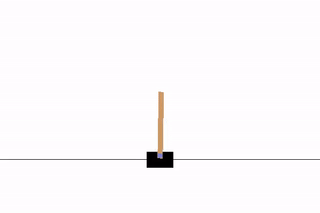
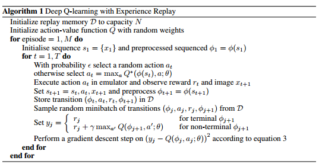
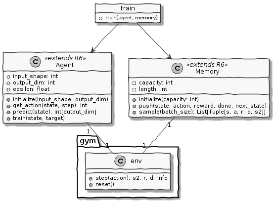
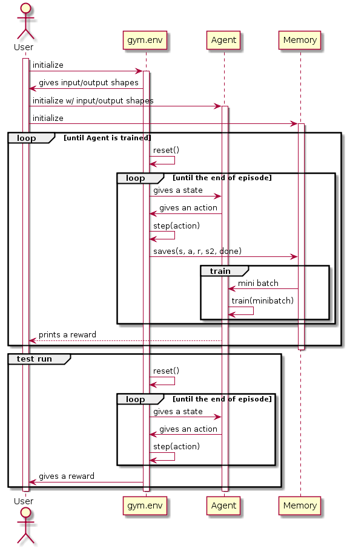
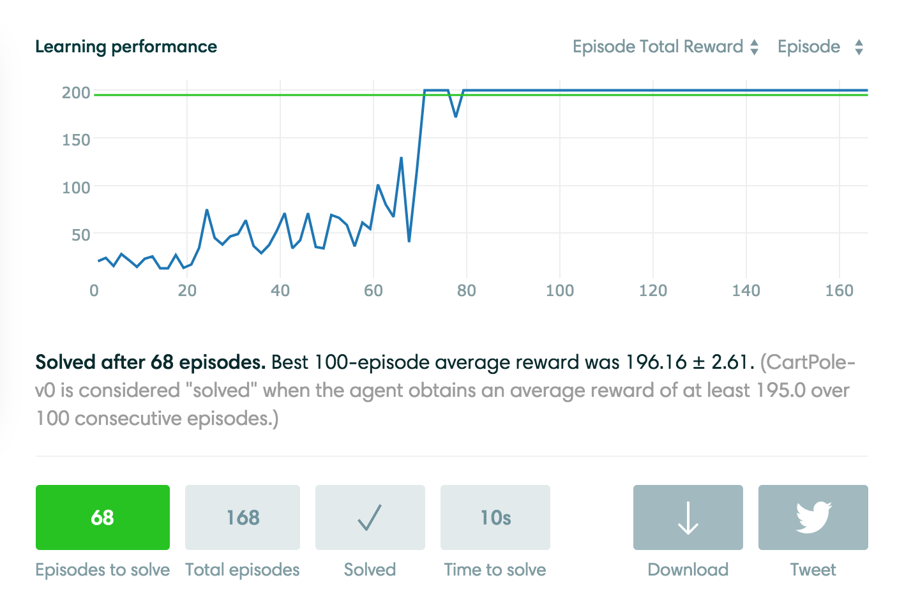

# DQN in R
Simple DQN implementation in R  
Original Paper: [Playing Atari with Deep Reinforcement Learning](https://www.cs.toronto.edu/~vmnih/docs/dqn.pdf)
<div align="center">

</div>

## Pseudocode

<div align="center">

</div>

## UML

<div align="center">


</div>


## Gym stat
<div align="center">

</div>
Link: https://gym.openai.com/evaluations/eval_iEDX4AWFRmu8gqoIkmlXA

## Dependencies
- tensorflow
- reticulate


## Files
```
.
├── Agent.R # Agent class is defined here
├── assets 
├── DQN-in-R.Rproj
├── main.R # the main file to run
├── Memory.R # Memory class is defined here (aka Experience Replay Memory)
├── README.md
└── train.R # training helper function
```